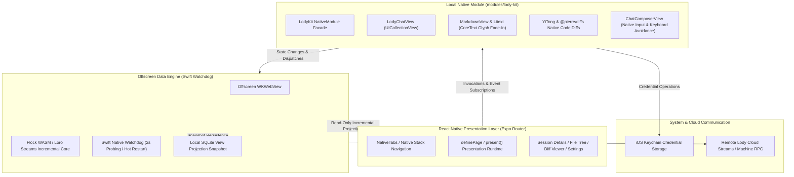

<div align="center">
  
  <h1>Lody iOS</h1>
  <p><b>Independent iOS Native Client</b> · AI Collaboration & Session Companion for Mobile</p>

  <p>
    
    
    
    
    
  </p>
</div>


---

## Overview

**Lody iOS** is an independent open-source client crafted for iPhone, providing a lightweight and secure bridge between remote Lody services and local workspaces.

The project uses a hybrid architecture of **React Native + a deeply customized Swift native module (LodyKit)**. While preserving the rapid iteration advantages of declarative cross-platform UI, critical interactions (infinite chat collection, streaming text rendering, code diff highlighting, file tree, etc.) are built with native Swift and CoreText to deliver an authentic iOS system feel.

---

## Features

### Authentic Apple HIG Native Experience

- **Human Interface Guidelines Compliance**: Native adoption of iOS semantic colors, automatic light and dark mode adaptation, and Dynamic Type with SF Pro and SF Mono.
- **Native Navigation**: Built on Expo Router native Stack and NativeTabs, supporting native soft scroll edge effects, interactive swipe-to-back gestures, and UIKit native grouped lists (`UICollectionViewListCell`).

### High-Performance Native Streaming Chat

- **Virtualized Chat Collection**: The chat view is backed by native Swift `UICollectionView`, maintaining full 60/120 fps smoothness even with extensive message histories.
- **CoreText Markdown Rendering**: Deeply integrated with [MarkdownView](https://github.com/Lakr233/MarkdownView) and [Litext](https://github.com/Lakr233/Litext), natively supporting complex tables, syntax-highlighted code blocks, task lists, LaTeX math formulas, and system text selection handles.
- **Smooth Character Fade-In**: Balanced batch scheduling paired with low-level `CTRunDraw` character alpha transitions delivers gentle, flicker-free streaming output during AI generation.
- **Native Input (`ChatComposerView`)**: Pixel-perfect keyboard avoidance matching system input methods, local draft persistence with automatic restoration, and real-time model thinking effort controls.

### Code Diffs & Workspace File Browsing

- **Turn Changes Overview**: Automatically summarizes file changes for each conversation turn, with one-tap access to all modified files.
- **Word-Level Diff Highlighting**: Powered by [YiTong](https://github.com/onevcat/YiTong) wrapping and locally rendering [@pierre/diffs](https://github.com/pierrecomputer/pierre/tree/main/packages/diffs), providing precise inline comparisons, syntax highlighting, and virtualized fast scrolling.
- **Remote Workspace File Tree**: Browse project directories and files on remote Macs or servers at any time, with previews via native code view `LodyCodeView` or system Quick Look.

### Offscreen WASM CRDT Data Sync Engine

- **Seamless CRDT Collaboration**: Executes official Loro / Flock CRDT incremental sync cores and Streams clients in a Swift-managed offscreen `WKWebView`, completely avoiding Node/CRDT/Zstd dependency bundling issues in React Native.
- **Watchdog Protection**: Native Swift probing keeps background execution resilient, supporting graceful hot recovery if an anomaly occurs.
- **Multi-Session Background Sync**: Local SQLite display projections ensure millisecond cold starts, while background synchronization maintains real-time bi-directional updates for active sessions.

### Security First & Hardware Isolation

- **Standard Device Flow Auth**: Authorizes via the official Better Auth Device Flow.
- **System Keychain Storage**: All authentication credentials and sensitive communication keys are strictly isolated in the iOS Keychain and never exposed in app-accessible shared storage.

---

## Architecture



---

## Directory Structure

```text
lody-ios/
├── apps/
│   └── mobile/
│       ├── src/
│       │   ├── app/                 # Expo Router routes and Stack declarations
│       │   ├── presentation/        # definePage / present() presentation runtime
│       │   ├── features/            # Feature domains (sessions, changes, files, settings)
│       │   ├── theme/               # Apple HIG semantic design tokens
│       │   └── ui/                  # Shared React Native base components
│       ├── modules/
│       │   └── lody-kit/            # First-party local native Swift module (LodyKit)
│       │       ├── ios/             # Swift / UIKit / CoreText native code
│       │       ├── data-runtime/    # Offscreen data runtime RPC and adapter scripts
│       │       └── src/             # Typed native component interfaces for React Native
│       ├── plugins/                 # Local Expo config plugins (e.g. cocoapods-spm config)
│       └── package.json
├── docs/                            # Architecture design, specs, and evolution docs
├── package.json                     # Monorepo root configuration
└── pnpm-workspace.yaml
```

---

## Development & Build

### Prerequisites

- **macOS**: Sequoia or later recommended
- **Xcode**: 16.0+ (with Command Line Tools installed)
- **Node.js**: `>= 22.13`
- **pnpm**: `11.10.0`
- **Ruby & Bundler**: System or Homebrew Ruby (`cocoapods` and `cocoapods-spm` recommended)

### Getting Started

1. **Clone the repository and install dependencies**:

   ```sh
   git clone https://github.com/Innei/lody-ios.git
   cd lody-ios
   pnpm install
   ```

2. **Generate native project and launch simulator**:

   ```sh
   pnpm ios
   ```

   > [!TIP]
   > This project uses `cocoapods-spm` to integrate SPM static library dependencies. `pnpm ios` automatically generates the native project and executes `bundle exec pod install` to fetch dependencies and link symbols.
   > After building native code once, run `pnpm start` directly when modifying only JavaScript to connect to the hot reload server.

3. **Update native assets**:

   If you modify runtime assets in `modules/lody-kit/data-runtime/`, run:

   ```sh
   pnpm --filter @lody-ios/mobile native:assets
   ```

### Quality Checks & Testing

```sh
pnpm check      # Run TypeScript type checks and Prettier formatting checks
pnpm test       # Run end-to-end session logic tests (Node.js 22 built-in test runner)
pnpm bundle     # Verify iOS Hermes JavaScript production bundle integrity
```

---

## Acknowledgements

Lody iOS is made possible thanks to these open-source projects and creators:

- **[FlowDown](https://github.com/Lakr233/FlowDown)**: Thanks to [Lakr233](https://github.com/Lakr233) and contributors. Lody's native message collection view, stream batching mechanism, and dynamic measurement cache architecture drew significant inspiration from FlowDown.
- **[MarkdownView](https://github.com/Lakr233/MarkdownView) & [Litext](https://github.com/Lakr233/Litext)**: High-performance, extensible CoreText Markdown rendering and typography for iOS.
- **[YiTong](https://github.com/onevcat/YiTong)**: Thanks to [onevcat](https://github.com/onevcat) for the elegant wrapper that enables native code diff rendering on iOS.
- **[@pierre/diffs](https://github.com/pierrecomputer/pierre/tree/main/packages/diffs)**: Excellent word-level diff algorithms and modern diff viewer experience.
- **[Loro](https://github.com/loro-dev/loro)**: High-performance, production-grade next-generation CRDT state synchronization.
